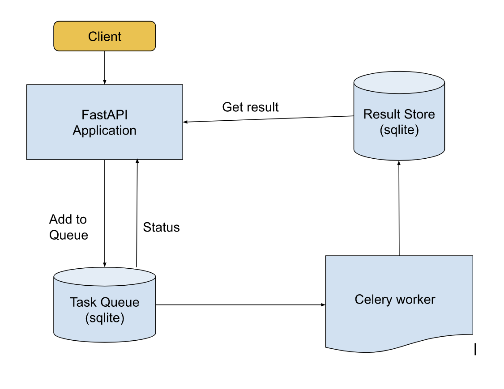

## Sample [FastAPI](https://fastapi.tiangolo.com/) Application to demonstrate Async architecture with [Celery](https://docs.celeryproject.org/)

Sample application utilizing FastAPI, Celery with sqlite for task queue. Sqlite is also used as result backend.
### Celery

[Celery](https://github.com/celery/celery) 
It’s a task queue with focus on real-time processing, while also supporting task scheduling.
It  helps us to handle asynchronous tasks.
# features
  * Timeout support for each task
  * Variety of options to replace JobQueue and Result back-end . Plug and play model
  * Better observability with [flower](https://flower.readthedocs.io/en/latest/) 
  * Purge old tasks

### Architecture

This sample application computes fibonacci number in async fashion.




How its useful in rbsAgent context ?
 -Many of our REST end-points(Ex: `Upload, CreateVmDkImages`) are going to be async. This provides generic framework. For every async API we will have to define
 task handler inside  `create_tasks/tasks.py`

### Setting up the VirtualEnv and install dependencies

Go inside the project folder and execute the below commands. Use `pipenv` to setup the VirtualEnv.
```
make .venv
```
Dependencies will be installed from the Pipfile. 

### Run the Application
Run fastAPI with uvicorn server
```
make server
```
Start the Celery process, navigate to the project directory in a new terminal, activate the virtual environment, and then run:
```
make wroker
```
### Test the application

Post a task to compute fibonacci :

```
curl -X POST localhost:5001/fibonacci/async -H 'Content-Type: application/json' -d '{"input" : 40}'
```
Response:

```
{"task_id":"cc809e2b-c591-453e-9a4f-7d30dc67f7a8"}
```

Get task status:
```
curl localhost:5001/fibonacci/task/cc809e2b-c591-453e-9a4f-7d30dc67f7a8
```
Response:
```
{"task_id":"cc809e2b-c591-453e-9a4f-7d30dc67f7a8","task_status":"STARTED","task_result":{"pid":20372,"hostname":"celery@us229.sjc.aristanetworks.com"}}
```
After sometime:

```
{"task_id":"cc809e2b-c591-453e-9a4f-7d30dc67f7a8","task_status":"SUCCESS","task_result":102334155}
```

The server will start at <http://localhost:5001/docs>.
